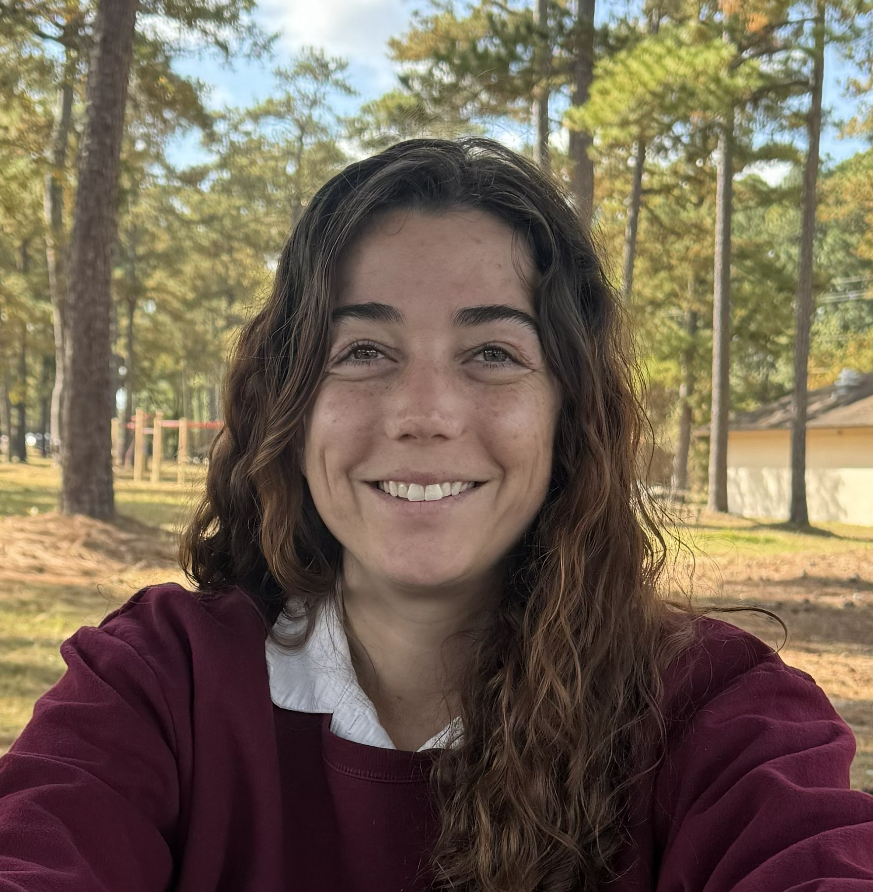

# ** SHANNON N. NOAH ** 
## ShannonNoah95@gmail.com   (240) 439-9047/ Frederick, MD 

## Education ## 

<ins> 2017-2019</ins>  
Towson University, BA in Fine Arts

<ins> 2014-2017</ins>  
Salisbury University, (transferred) 

## Experience ##
		
### Present: Maid, Maidpro, Frederick, MD
As a Pro at Maidpro, I clean houses, interact with clientele, and ensure they are happy with our results.  I Manage time efficiently while working in small teams. 

### April -August 2025: Museum Curation Intern 
Airborne and Special Operations Museum, Fayetteville NC 28309 

- I researched and curated a temporary exhibit, collaborated with neighboring museums, and created an online reference for the museum’s library. 

### 2020-2025: Military Police, 18th Abn Corps, Ft. Liberty NC 28310
	
- <ins> 2020-2021  Military Police Patrol, 21st MP Co</ins>  
I Interacted daily with the public, completed case work, and worked with ALERTS database.  

- <ins> 2021-2022 Desk Clerk, 42d MP Det</ins> 
	I worked directly with customers at the Provost Marshal’s Office front desk as a clerk, handling important information and documents, finding the correct information from a diverse field, and ensuring the right people are connected.  

- <ins>2022-2023 Police Laison, Desertion Apprehension Team (DAT), 42d MP Det</ins> 
I ensured there was streamlined communication for Command teams and State Law Enforcement to ensure the safe return of soldiers. This included the teaching of Escort Teams, the proper procedure in handling detained soldiers and their safe transportation. 

- <ins> 2023-2025 Military Police Investigator, 42d MP Det</ins> 
As a Military Police investigator, I have investigated and handled cases, managed crime scenes, conducted interviews and interrogations, and executed booking procedures.  
